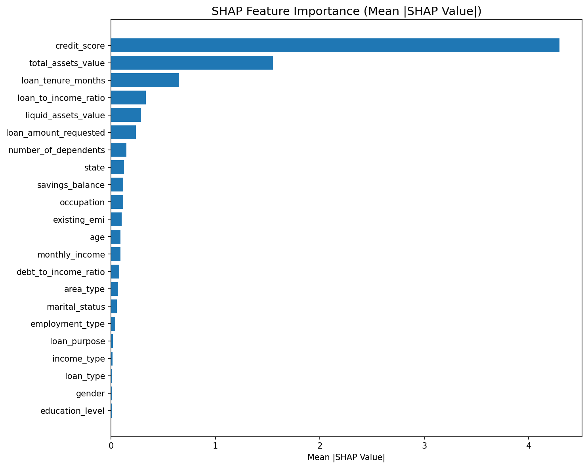
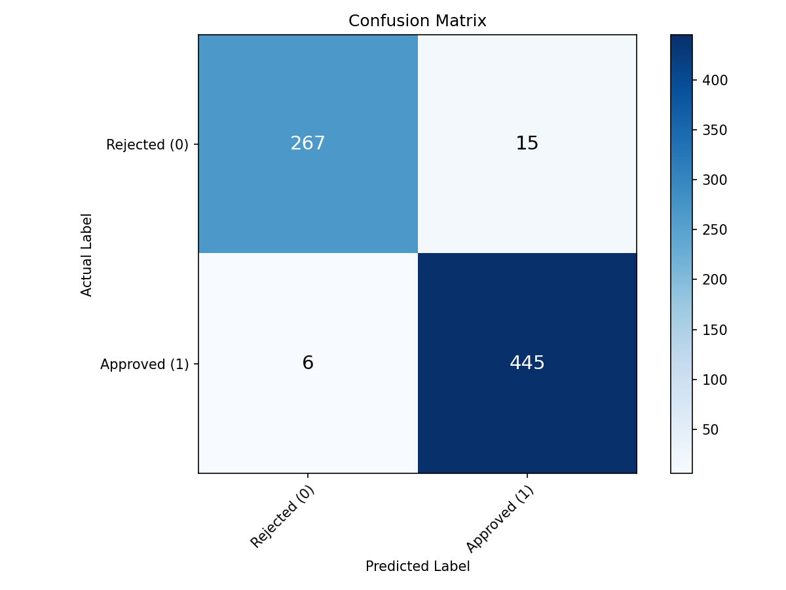
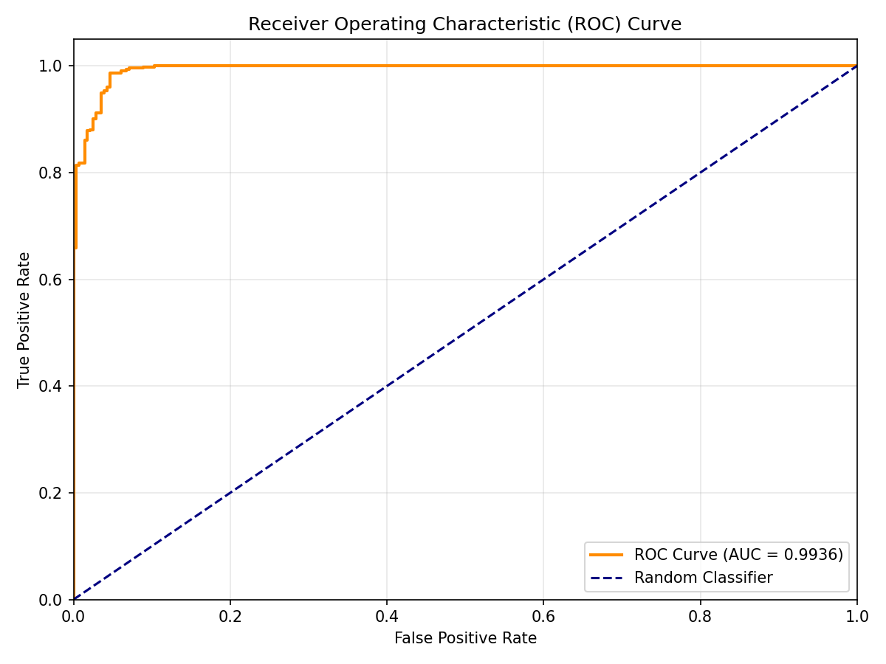

# Rupya AI — AI-Powered Credit Underwriting Platform

**Rupya AI** is a comprehensive, modern credit underwriting platform that combines a traditional loan origination system with advanced, explainable Artificial Intelligence (XAI). It empowers financial institutions to automate risk assessment and provides credit analysts with transparent, SHAP-driven insights into exactly *why* a loan should be approved or rejected.

---

## Key Features

### Customer Portal
- **Account Management:** Secure signup, login, and profile management for loan applicants.
- **Loan Application:** Multi-step loan application process capturing personal, employment, and financial details.
- **Application Tracking:** Real-time visibility into loan application status and decisions.

### Analyst Dashboard
- **Application Pipeline:** Queue of incoming loan applications requiring review.
- **Detailed Profiles:** View complete applicant details, including credit bureau reports (simulated).
- **Manual Decisions:** Approve, reject, or conditionally approve applications with attached notes.

### Explainable AI Risk Assessment
- **XGBoost Risk Model:** Highly accurate machine learning model trained on demographic, financial, and credit data.
- **SHAP Integration:** Transparent decision-making. Every prediction includes a breakdown of exactly which features positively or negatively impacted the risk score.
- **Analyst Integration:** AI assessments are rendered directly inside the analyst's review workflow, complete with color-coded risk categories (Low, Medium, High, Very High) and probability scores.

## Model Evaluation & Metrics

The XGBoost model was evaluated on a held-out test set, achieving the following performance:

- **Accuracy:** 97.14%
- **Precision:** 97.15%
- **Recall:** 97.14%
- **F1 Score:** 97.13%
- **ROC AUC:** 0.9936

### Feature Importance (SHAP Summary)
The model uses SHAP (SHapley Additive exPlanations) to provide transparent, interpretable predictions. The summary plot below shows the most impactful features (e.g., Credit Score, Total Assets, Loan Tenure) across the entire dataset:



### Confusion Matrix
This matrix demonstrates the model's high precision and recall, effectively minimizing false positives and false negatives for both Approved and Rejected applications.



### ROC Curve
The Receiver Operating Characteristic curve highlights the model's excellent separability between risk classes, with an Area Under the Curve (AUC) of 0.99.



---

## Technology Stack

**Backend & Web**
- **Node.js & Express.js:** Core web server and API routing.
- **EJS:** Server-side templating for dynamic, responsive views.
- **Bootstrap 5:** Frontend CSS framework for a clean, modern UI.
- **Passport.js:** Secure, role-based authentication (Customer vs. Analyst).
- **Child Process:** Seamless integration to orchestrate Python AI scripts.

**Database**
- **Supabase (PostgreSQL):** Cloud-hosted relational database. Stores users, profiles, loan applications, credit inquiries, and AI risk assessments.

**Artificial Intelligence**
- **Python 3.12:** Core language for the data science pipeline.
- **XGBoost:** Gradient boosting library used for classification.
- **SHAP:** Explainable AI framework to interpret model predictions.
- **Pandas & NumPy:** Data preprocessing, imputation, and feature engineering.
- **Scikit-Learn:** Data splitting and evaluation metrics.

---

## Project Structure

```
rupya-ai/
├── ai/                     # Artificial Intelligence Module
│   ├── data/               # Raw and synthetic datasets
│   ├── models/             # Pickled XGBoost models and encoders
│   ├── outputs/            # Evaluation metrics, confusion matrix, ROC curves
│   └── src/                # Python source code
│       ├── config.py       # ML configuration and paths
│       ├── preprocess.py   # Data cleaning and feature engineering
│       ├── train.py        # Model training pipeline
│       ├── evaluate.py     # Model validation and scoring
│       ├── explain.py      # SHAP analysis pipeline
│       ├── predict.py      # Inference script (called by Node.js via stdin)
│       └── utils.py        # Helper functions
├── config/                 # Node.js Configurations (Passport, Supabase)
├── database/               # SQL Schema and Migration Scripts
├── public/                 # Static assets (CSS, JS, Images)
├── routes/                 # Express.js route handlers
│   ├── analyst_routes.js   # Analyst dashboard and review logic
│   ├── auth_routes.js      # Customer authentication
│   └── customer_routes.js  # Customer dashboard and application logic
├── views/                  # EJS Templates
│   ├── analyst/            # Analyst-facing pages
│   ├── customer/           # Customer-facing pages
│   └── partials/           # Reusable UI components (header, footer, nav)
├── app.js                  # Express Server Entry Point
└── package.json            # Node.js dependencies
```

---

## Setup & Installation

### Prerequisites
- Node.js (v18+)
- Python (3.10+)
- A Supabase Account

### 1. Clone the Repository
```bash
git clone https://github.com/navinvishwa07/ai-credit-underwriting-platform.git
cd ai-credit-underwriting-platform
```

### 2. Database Setup
1. Create a new project in Supabase.
2. Execute the SQL scripts found in the `database/` directory in the Supabase SQL Editor:
   - Run `schema.sql` to establish tables and relationships.
   - Run `seed_lookups.sql` (if applicable) to populate initial lookup data.

### 3. Backend Setup
Install the Node.js dependencies:
```bash
npm install
```

Create a `.env` file in the root directory:
```env
SUPABASE_URL=your_supabase_project_url
SUPABASE_ANON_KEY=your_supabase_anon_key
SESSION_SECRET=a_secure_random_string
```

### 4. AI Setup
Navigate to the AI directory and install the Python dependencies:
```bash
cd ai
pip install pandas numpy scikit-learn xgboost shap matplotlib
```

*(Optional)* Train the model from scratch:
```bash
cd src
python train.py
```
This will process the data, train the XGBoost model, and save the artifacts in `ai/models/`.

### 5. Running the Application
Return to the root directory and start the Express server:
```bash
node app.js
```
The application will be accessible at `http://localhost:3000`.

---

## How the AI Integration Works

When an Analyst clicks **"Run AI Assessment"** on a loan application:
1. The Express route fetches the applicant's profile, financial data, and credit history from Supabase.
2. Node.js formats this data into a JSON payload and spawns a `child_process` calling `python3 ai/src/predict.py`.
3. The JSON data is piped to Python via `stdin`.
4. `predict.py` loads the pre-trained XGBoost model and encoders, preprocesses the input, and generates a risk probability.
5. `predict.py` then uses XGBoost's built-in `pred_contribs` to calculate SHAP values, identifying exactly which financial factors pushed the score up or down.
6. Python prints the results back as JSON to `stdout`.
7. Node.js parses the JSON, saves the assessment and top risk factors to Supabase, and updates the UI for the Analyst.

---

## License
This project is proprietary and confidential. All rights reserved.
